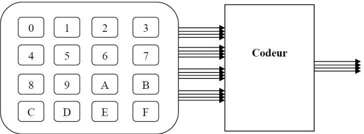

<h1 align='center'>Conception VHDL et simulation d'une serrure à combinaison électronique.</h1>

## Définition de VHDL

* Le langage de description matérielle VHSIC est un langage de description matérielle qui peut modéliser le comportement et la structure des systèmes numériques à plusieurs niveaux d'abstraction, allant du niveau système jusqu'à celui des portes logiques, à des fins de saisie de conception, de documentation et de vérification.
* L’abréviation VHDL signifie VHSIC Hardware Description Langage (VHSIC : Very High Speed Integrated Circuit). Ce langage a été écrit dans les années 70 pour fournir un langage de haut niveau adapté à la description fonctionnelle des systèmes complexes.

## Objectifs
* L’objectif premier de ce projet est de modéliser en langage VHDL un circuit de serrure à combinaison électronique, et puis de valider la description élaborée en procédant à une simulation sur le logiciel Modelsim. 
* Ce projet sera une occasion pour faire un retour sur les approches de descriptions fournies par le langage VHDL, ainsi que pour développer une bonne maitrise des différentes structures algorithmiques qui sont à la base de ces approches. 
* Chaque description réalisée doit être obligatoirement accompagnée d’un banc de test qui la valide.
* Chaque composant, avant qu’il soit modélisé, nécessite une recherche approfondie autour de son fonctionnement. 

## INTRODUCTION

une serrure est un mécanisme fonctionnant avec une clé, permettant de bloquer une porte ou une ouverture en position fermée.
Le projet consiste à réaliser une serrure qui composent d'un(e):
* Codeur : son rôle est de traduire le code généré par le clavier et transporté par **le bus data_in** en code binaire sur 4-bits qui sera envoyé au système via le **bus data_s**.
* Détecteur :son rôle est de détecter l’appui sur une touche et positionner **le signal detect à 1**. Si aucune pression sur une touche n’est détectée , **le signal de sortie est mis à 0**.
* Mémoire :son rôle est de stocker le code saisi par l’utilisateur. Elle est constituée de **4 registres lecture/écriture parallèles 4-bits actifs
sur front montant**. Quand le signal Detect passe à l'état haut, la valeur du signal présent sur la sortie du codeur (data_s) est stockée dans le premier registre et les valeurs précédentes contenues dans les autres registres sont décalées d'un registre. Le bus code_sig reçoit donc les valeurs des quatre registres. Les 4 premiers bits de ce bus représentent la valeur du premier registre qui correspondent au chiffre de la touche enfoncée en dernier.
* Comparateur : son rôle est de détecter l’égalité de deux valeurs codés sur **16 bits en entrée**. La clef de la serrure qui fera la base
de comparaison (fixed_key) est fixé à 1234. Lorsque le code entré par l'utilisateur est égal au code de la clef, le signal ouverture passe à 1, sinon le signal ouverture reste à 0. Pour élaborer la description VHDL du comparateur 16-bits, il faut tout d’abord réaliser la description d’un comparateur 4-bits et puis faire le câblage nécessaire

## Présentation du circuit de la serrure 
Une serrure à combinaison électronique nécessite la composition d’un code confidentiel
(chiffres et/ou lettres) pour être déverrouillée. Dans le cas de la serrure qui fera l’objet de ce
projet, le code est constitué de 4 chiffres qu’il faut taper sur un clavier de 16 touches
numériques connectées à la serrure. Chaque touche est connectée au codeur de la serrure
via un fils du bus de données binaires (data_in) de 16 bits. Les connexions avec le codeur
sont montrées sur la figure suivante :

Tous les fils du bus sont au niveau bas tant qu'aucune touche n'est encore pressée. L'appui
sur une des touches met le fil qui la relie au codeur au niveau haut tandis que les autres fils
restent au niveau bas. La table suivante montre l’état de bus de données lors de l'appui sur
les différentes touches du clavier.

